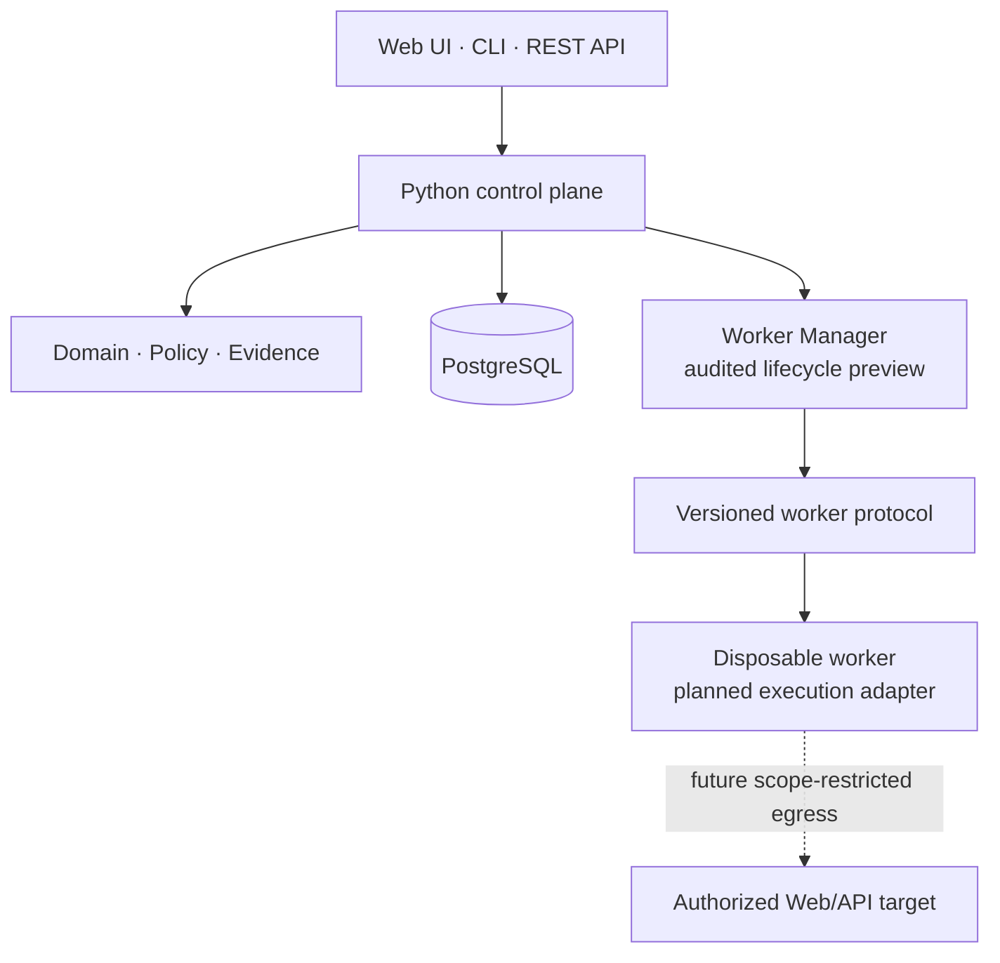

<div align="center">

# vuln-proof-claw

**A safety-first control plane for evidence-driven, authorized Web and API security testing.**

[繁體中文](README.zh-TW.md) · [Architecture](ARCHITECTURE.md) · [Roadmap](ROADMAP.md) · [Security](SECURITY.md) · [Contributing](CONTRIBUTING.md)

[](https://github.com/and910805/vuln-proof-claw/actions/workflows/ci.yml)
[](https://github.com/and910805/vuln-proof-claw/actions/workflows/container.yml)

[](CHANGELOG.md)
[](LICENSE)


</div>

> [!IMPORTANT]
> **Pre-alpha status:** Phase 0.0.15 includes one opt-in, scope-checked passive URL
> assessment that sends a bounded `GET`, stores evidence, and derives conservative
> findings. It does not crawl, call an LLM, launch external scanners, authenticate to
> targets, or execute exploit payloads. All broader execution paths fail closed.

## Why vuln-proof-claw?

A useful security result is more than a plausible vulnerability claim. It needs a
clear authorization boundary, reproducible evidence, an approval trail for risky
actions, and an independent path to verification.

vuln-proof-claw is being built around those requirements:

- **Scope before action** — normalized targets are checked against explicit host,
  network, port, path, scheme, and time boundaries.
- **Evidence before claims** — canonical metadata and SHA-256 hash chains make
  evidence records verifiable.
- **Approval by risk** — actions are classified from L0 through L4, with approvals
  bound to the exact action and protected parameters.
- **Isolation by design** — target-facing work is designed for disposable,
  credential-free workers with restricted resources and network access.
- **Fail closed** — unknown actions default to a conservative risk level, invalid
  scope is denied, and unfinished execution paths remain disabled.

## Current capabilities

| Area | Available in Phase 0 |
| --- | --- |
| CLI | Version command and credential-safe `doctor` diagnostics |
| REST API | Versioned health, project, engagement, passive assessment, workflow, audit, and report contracts with OpenAPI |
| Web console | Bilingual dashboard, tab-scoped operator authentication, authorized URL assessment wizard, persistent project-filtered history, report downloads, and truthful capability status |
| Evidence Core preview | Scoped passive URL assessment, transactional evidence, deterministic findings, and immutable reports |
| Domain | Projects, engagements, tasks, flows, actions, approvals, evidence, and findings |
| Policy | Web/API target normalization, default-deny scope checks, L0–L4 risk, action-bound approvals |
| Authentication | Optional API-wide Bearer boundary with distinct operator, approver, and evidence-reader roles |
| Evidence | Canonical serialization, SHA-256 digests, and tamper-evident hash-chain primitives |
| Persistence | PostgreSQL repositories and Alembic migrations without ORM leakage into domain code |
| Observability | Structured human/JSON logs with recursive secret redaction |
| Execution | Opt-in DNS-pinned passive GET capture plus durable Worker, orphan-cleanup, and restricted-container policy boundaries; the privileged Engine gateway and arbitrary tools remain disabled |
| Delivery | Hardened Docker Compose baseline, bilingual-doc checks, dependency audit, container scan, and SBOM CI |

Crawler-based discovery, security-tool and exploit execution, LLM orchestration,
Planner/Operator/Verifier agents, and advanced HTML/SARIF reporting remain roadmap items.

## Quick start

### Option A: Docker Compose

This is the recommended way to start the API and PostgreSQL locally.

Requirements: Git and Docker Compose v2.

```bash
git clone https://github.com/and910805/vuln-proof-claw.git
cd vuln-proof-claw
docker compose up --build -d
```

Check the service:

```bash
curl --fail http://127.0.0.1:8080/api/v1/health/ready
```

Then open:

- Web console: <http://127.0.0.1:8080/>
- API documentation: <http://127.0.0.1:8080/docs>
- Liveness: <http://127.0.0.1:8080/api/v1/health/live>
- Readiness: <http://127.0.0.1:8080/api/v1/health/ready>

Stop the stack without deleting database data:

```bash
docker compose down
```

The Compose defaults are for local development only. Set your own PostgreSQL
credentials before using the stack in a shared environment.

### Option B: Local CLI

Requirements: Python 3.12 or newer. PostgreSQL, the API, and Docker are optional
for installation but are reported by `doctor` when unavailable.

PowerShell:

```powershell
git clone https://github.com/and910805/vuln-proof-claw.git
Set-Location vuln-proof-claw
python -m venv .venv
.\.venv\Scripts\python.exe -m pip install --upgrade "pip>=26.1.2"
.\.venv\Scripts\python.exe -m pip install --editable ".[dev]"
.\.venv\Scripts\python.exe -m vuln_proof_claw --version
.\.venv\Scripts\python.exe -m vuln_proof_claw doctor
```

Linux and macOS:

```bash
git clone https://github.com/and910805/vuln-proof-claw.git
cd vuln-proof-claw
python3 -m venv .venv
.venv/bin/python -m pip install --upgrade "pip>=26.1.2"
.venv/bin/python -m pip install --editable ".[dev]"
.venv/bin/python -m vuln_proof_claw --version
.venv/bin/python -m vuln_proof_claw doctor
```

Use `doctor --json` for the stable, machine-readable v1 diagnostic report.

## Risk and approval model

The policy core classifies actions before execution:

| Level | Examples | Default policy |
| --- | --- | --- |
| L0 | Public pages, `robots.txt`, passive fingerprinting | Automatic |
| L1 | Directory enumeration, port scanning, active API probing | Project-configurable |
| L2 | Exploit attempts, password testing, file uploads | Explicit approval required |
| L3 | Post-exploitation, privilege escalation, lateral movement | Explicit approval required |
| L4 | Data modification/deletion, persistence, destructive operations | Disabled by default; project enablement and per-action approval required |

An approval cannot authorize a modified payload, target, or protected parameter.
Out-of-scope and permanently denied actions take precedence over approval.

## Architecture



The control plane is a Python modular monolith. Domain code does not depend on
FastAPI, SQLAlchemy, Docker, or provider SDKs. Target-facing execution crosses an
explicit worker protocol boundary and is designed to receive neither provider
credentials nor host home-directory mounts.

See [ARCHITECTURE.md](ARCHITECTURE.md) and
[Worker and container security](docs/WORKER_SECURITY.md) for the trust boundaries
and invariants.

## Configuration

Configuration uses nested environment variables with the
`VULN_PROOF_CLAW_` prefix:

| Variable | Purpose | Default |
| --- | --- | --- |
| `VULN_PROOF_CLAW_APP__ENVIRONMENT` | `development`, `test`, or `production` | `development` |
| `VULN_PROOF_CLAW_API__HOST` | API bind address | `127.0.0.1` |
| `VULN_PROOF_CLAW_API__PORT` | API port | `8080` |
| `VULN_PROOF_CLAW_DATABASE__URL` | SQLAlchemy PostgreSQL URL | Local PostgreSQL URL |
| `VULN_PROOF_CLAW_LOGGING__FORMAT` | `human` or `json` | `human` |
| `VULN_PROOF_CLAW_LOGGING__LEVEL` | Logging threshold | `INFO` |

See [.env.example](.env.example) for the complete reference. Never commit real
provider keys, customer credentials, or captured target data.

## Project status and roadmap

Phase 0 is the completed foundation. The v0.1 preview now includes persisted
engagements, structured HTTP capture, durable disposable-worker state, guarded raw
evidence review, immutable Markdown/JSON report exports, a tested orphan-runtime
cleanup contract, and a complete restricted-container policy adapter. A privileged
Engine gateway, scoped egress, worker executor, and startup integration remain before
the Evidence Core milestone is complete.

See [ROADMAP.md](ROADMAP.md) for planned milestones. Roadmap items describe intent,
not guaranteed release dates.

## Documentation

Maintained project documentation is published in English and Traditional Chinese.
CI rejects an English Markdown document without its `.zh-TW.md` peer.

| Topic | English | 繁體中文 |
| --- | --- | --- |
| Architecture | [ARCHITECTURE.md](ARCHITECTURE.md) | [ARCHITECTURE.zh-TW.md](ARCHITECTURE.zh-TW.md) |
| Roadmap | [ROADMAP.md](ROADMAP.md) | [ROADMAP.zh-TW.md](ROADMAP.zh-TW.md) |
| Security policy | [SECURITY.md](SECURITY.md) | [SECURITY.zh-TW.md](SECURITY.zh-TW.md) |
| Contributing | [CONTRIBUTING.md](CONTRIBUTING.md) | [CONTRIBUTING.zh-TW.md](CONTRIBUTING.zh-TW.md) |
| Web console | [docs/WEB_UI.md](docs/WEB_UI.md) | [docs/WEB_UI.zh-TW.md](docs/WEB_UI.zh-TW.md) |
| Evidence Core preview | [docs/EVIDENCE_CORE.md](docs/EVIDENCE_CORE.md) | [docs/EVIDENCE_CORE.zh-TW.md](docs/EVIDENCE_CORE.zh-TW.md) |
| Controlled HTTP capture | [docs/HTTP_CAPTURE.md](docs/HTTP_CAPTURE.md) | [docs/HTTP_CAPTURE.zh-TW.md](docs/HTTP_CAPTURE.zh-TW.md) |
| Control-plane workflow API | [docs/WORKFLOW_API.md](docs/WORKFLOW_API.md) | [docs/WORKFLOW_API.zh-TW.md](docs/WORKFLOW_API.zh-TW.md) |
| Authentication and approvals | [docs/AUTH_AND_APPROVALS.md](docs/AUTH_AND_APPROVALS.md) | [docs/AUTH_AND_APPROVALS.zh-TW.md](docs/AUTH_AND_APPROVALS.zh-TW.md) |
| Evidence access and report exports | [docs/EVIDENCE_ACCESS_AND_REPORT_EXPORTS.md](docs/EVIDENCE_ACCESS_AND_REPORT_EXPORTS.md) | [docs/EVIDENCE_ACCESS_AND_REPORT_EXPORTS.zh-TW.md](docs/EVIDENCE_ACCESS_AND_REPORT_EXPORTS.zh-TW.md) |
| Passive URL assessment | [docs/PASSIVE_ASSESSMENT.md](docs/PASSIVE_ASSESSMENT.md) | [docs/PASSIVE_ASSESSMENT.zh-TW.md](docs/PASSIVE_ASSESSMENT.zh-TW.md) |
| Disposable Worker lifecycle | [docs/WORKER_LIFECYCLE.md](docs/WORKER_LIFECYCLE.md) | [docs/WORKER_LIFECYCLE.zh-TW.md](docs/WORKER_LIFECYCLE.zh-TW.md) |
| Runtime resource janitor | [docs/RUNTIME_JANITOR.md](docs/RUNTIME_JANITOR.md) | [docs/RUNTIME_JANITOR.zh-TW.md](docs/RUNTIME_JANITOR.zh-TW.md) |
| Restricted Docker runtime boundary | [docs/RESTRICTED_RUNTIME.md](docs/RESTRICTED_RUNTIME.md) | [docs/RESTRICTED_RUNTIME.zh-TW.md](docs/RESTRICTED_RUNTIME.zh-TW.md) |
| Platform design | [English](docs/superpowers/specs/2026-07-30-vuln-proof-claw-platform-design.md) | [繁體中文](docs/superpowers/specs/2026-07-30-vuln-proof-claw-platform-design.zh-TW.md) |
| Phase 0 implementation plan | [English](docs/superpowers/plans/2026-07-30-phase-0-foundation-implementation-plan.md) | [繁體中文](docs/superpowers/plans/2026-07-30-phase-0-foundation-implementation-plan.zh-TW.md) |

## Development

After installing the development dependencies:

```bash
python -m ruff check .
python -m mypy
python -m pytest --cov=vuln_proof_claw --cov-report=term-missing
python scripts/check_bilingual_docs.py
python -m pip_audit
python -m bandit -r src
```

Live PostgreSQL and Docker Compose integration tests are opt-in. The default unit
suite does not contact external targets.

## Responsible use

Use vuln-proof-claw only against systems you own or are explicitly authorized to
test. Define the engagement scope before testing, minimize accessed data, and stop
when continued activity could harm users or infrastructure.

Security vulnerabilities in this project should be reported privately according
to [SECURITY.md](SECURITY.md), not through a public issue.

## Contributing

Bug reports, design discussions, documentation improvements, and focused pull
requests are welcome. Read [CONTRIBUTING.md](CONTRIBUTING.md) and the
[Code of Conduct](CODE_OF_CONDUCT.md) before contributing.

## License

vuln-proof-claw is released under the [MIT License](LICENSE).
