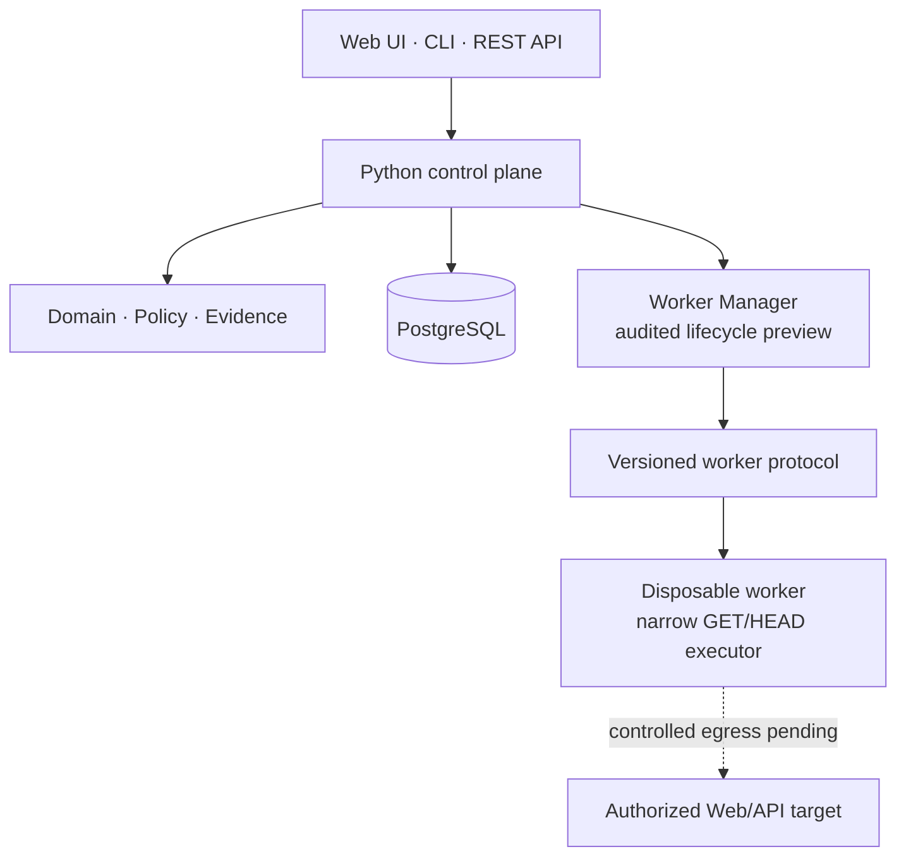

<div align="center">

# vuln-proof-claw

**A safety-first control plane for evidence-driven, authorized Web and API security testing.**

[繁體中文](README.zh-TW.md) · [Architecture](ARCHITECTURE.md) · [Roadmap](ROADMAP.md) · [Security](SECURITY.md) · [Contributing](CONTRIBUTING.md)

[](https://github.com/and910805/vuln-proof-claw/actions/workflows/ci.yml)
[](https://github.com/and910805/vuln-proof-claw/actions/workflows/container.yml)

[](CHANGELOG.md)
[](LICENSE)


</div>

> [!IMPORTANT]
> **Alpha status:** Version 0.6.0 adds one-click, metadata-only disclosure bundles and
> offline SHA-256 verification. Raw Evidence and secrets remain excluded. Version 0.5.0
> introduced the bounded Planner/Operator/Verifier and local MCP foundations.
>
> Version 0.3.0 added authorized safe active testing to bounded Web
> discovery. It inventories captured OpenAPI documents and verifies only parameterless
> GET/HEAD operations through the existing scope, DNS, evidence, and budget controls.
> It does not authenticate, submit forms, invoke external scanners, or send exploit payloads.

## Why vuln-proof-claw?

A useful security result is more than a plausible vulnerability claim. It needs a
clear authorization boundary, reproducible evidence, an approval trail for risky
actions, and an independent path to verification.

vuln-proof-claw is being built around those requirements:

- **Scope before action** — normalized targets are checked against explicit host,
  network, port, path, scheme, and time boundaries.
- **Evidence before claims** — canonical metadata and SHA-256 hash chains make
  evidence records verifiable.
- **Approval by risk** — actions are classified from L0 through L4, with approvals
  bound to the exact action and protected parameters.
- **Isolation by design** — target-facing work is designed for disposable,
  credential-free workers with restricted resources and network access.
- **Fail closed** — unknown actions default to a conservative risk level, invalid
  scope is denied, and unfinished execution paths remain disabled.

## Current capabilities

| Area | Current release |
| --- | --- |
| CLI | Version, credential-safe `doctor`, and network-free `verify-bundle` commands |
| REST API | Versioned health, project, engagement, automated assessment, workflow, audit, and report contracts with OpenAPI |
| Web console | Bilingual URL-first safe automation, discovery-only fallback, Safe/Fast/Deep presets, Finding review, history, four report formats, and verifiable disclosure bundles |
| Evidence Core | Multi-page discovery, semantic OpenAPI inventory, bounded read-only API verification, transactional evidence, immutable reports, and evidence-backed review state |
| Domain | Projects, engagements, tasks, flows, actions, approvals, evidence, and findings |
| Policy | Web/API target normalization, default-deny scope checks, L0–L4 risk, action-bound approvals |
| Authentication | Optional API-wide Bearer boundary with distinct operator, approver, and evidence-reader roles |
| Evidence | Canonical serialization, SHA-256 digests, and tamper-evident hash-chain primitives |
| Persistence | PostgreSQL repositories and Alembic migrations without ORM leakage into domain code |
| Observability | Structured human/JSON logs with recursive secret redaction |
| Execution | DNS-pinned GET/HEAD verification plus disposable Playwright Chromium contexts, in-memory login credentials, outbound host filtering, durable Workers, and restricted-container policy; arbitrary tools remain disabled |
| Automation | Reviewed query/header/path mutation plans, CORS/authentication/authorization/input-validation comparisons, approval presets, and Planner/Operator/Verifier task generation |
| AI interface | Local stdio MCP server for Codex, Claude Code, and compatible clients; credentials stay in the client environment |
| Delivery | Hardened Docker Compose baseline, bilingual-doc checks, dependency audit, container scan, and SBOM CI |

Browser execution and automation are API/MCP-first in v0.5.0; Web-console controls, richer
session methods, live execution progress, external security tools, exploit execution, and
bug-bounty-specific reporting remain roadmap items. See [Safe Automation](docs/SAFE_AUTOMATION.md)
and [AI Driver Architecture](docs/AI_DRIVER.md).

## Release highlights

The project is intentionally delivered in small, auditable milestones. Each version
adds a user-completable capability while keeping the execution boundary explicit.

| Version | Major additions | What it still does not do |
| --- | --- | --- |
| **v0.1.0** | First usable passive assessment: URL-first Web console, automatic Project/Engagement setup, exact Scope, DNS-pinned GET capture, deterministic header/cookie Findings, Evidence integrity, JSON/Markdown reports, and persisted history. | No crawl, login, form submission, active payload, or automatic vulnerability confirmation. |
| **v0.2.0** | Bounded same-origin discovery with Safe/Fast/Deep budgets, per-page Evidence, aggregate Findings, severity/confidence/remediation, and escaped HTML reports. | No authentication, browser session, external scanner, parameter mutation, or exploit validation. |
| **v0.3.0** | OpenAPI 3.x/Swagger 2.0 operation inventory and `active-safe` verification of parameterless GET/HEAD operations, including evidence-backed declared-authentication candidates. | No write methods, required parameters, login, browser automation, exploit payloads, or arbitrary tools. |
| **v0.3.1** | Documentation and release metadata update: this version history, corrected Quick Start guidance, and synchronized package/user-agent versions. | No new target-facing capability; the security boundary is unchanged from v0.3.0. |
| **v0.4.0** | Operator Finding review with optimistic version checks and immutable audit events; SARIF 2.1.0 direct reports and idempotent immutable exports; Web console SARIF download. | No Planner/Operator/Verifier orchestration, browser authentication, write-method testing, exploit payloads, or arbitrary tools. |
| **v0.5.0** | Disposable authenticated Chromium contexts, reviewed benign parameter mutations, CORS/authentication/authorization/input-validation comparison, reusable Approval Presets, Planner/Operator/Verifier plans, and Codex/Claude Code stdio MCP tools. | Advanced paths remain API/MCP-first; no destructive payloads, arbitrary scanner execution, automatic privilege escalation, or unrestricted target access. |
| **v0.6.0** | Metadata-only disclosure ZIP with JSON/Markdown/HTML/SARIF, workflow and Evidence-chain metadata, Web downloads, and an offline verifier hardened against unsafe ZIP structures and tampering. | No raw Evidence disclosure, signer identity, arbitrary scanner execution, exploit payloads, or unrestricted target access. |

For implementation details and the next milestones, see [ROADMAP.md](ROADMAP.md) and the
versioned entries in [CHANGELOG.md](CHANGELOG.md).

## Quick start

### Option A: Docker Compose

This is the recommended way to start the API and PostgreSQL locally.

Requirements: Git and Docker Compose v2.

```bash
git clone https://github.com/and910805/vuln-proof-claw.git
cd vuln-proof-claw
docker compose up --build -d
```

Open <http://127.0.0.1:8080/>, select **Assess a URL**, enter a public HTTP(S)
URL you are authorized to test, acknowledge authorization once, and run it. The
first run creates its private workspace automatically. Safe automated mode discovers
same-origin pages and verifies eligible read-only API operations; discovery-only mode,
Fast mode, and Deep mode are available in the form. The result view shows prioritized
findings, API inventory, active-probe counts, evidence integrity, and JSON, Markdown,
escaped HTML, and SARIF 2.1.0 reports.
The result and history views also download a self-verifiable disclosure bundle.

Check the service:

```bash
curl --fail http://127.0.0.1:8080/api/v1/health/ready
```

Then open:

- Web console: <http://127.0.0.1:8080/>
- API documentation: <http://127.0.0.1:8080/docs>
- Liveness: <http://127.0.0.1:8080/api/v1/health/live>
- Readiness: <http://127.0.0.1:8080/api/v1/health/ready>

Stop the stack without deleting database data:

```bash
docker compose down
```

The Compose defaults are for local development only. They enable only the bounded
safe assessment path and bind the UI to loopback. Set your own PostgreSQL
credentials and enable API authentication before using the stack in a shared
environment. The application default remains fail-closed outside this local profile.

### Option B: Local CLI

Requirements: Python 3.12 or newer. PostgreSQL, the API, and Docker are optional
for installation but are reported by `doctor` when unavailable.

PowerShell:

```powershell
git clone https://github.com/and910805/vuln-proof-claw.git
Set-Location vuln-proof-claw
python -m venv .venv
.\.venv\Scripts\python.exe -m pip install --upgrade "pip>=26.1.2"
.\.venv\Scripts\python.exe -m pip install --editable ".[dev]"
.\.venv\Scripts\python.exe -m vuln_proof_claw --version
.\.venv\Scripts\python.exe -m vuln_proof_claw doctor
```

Linux and macOS:

```bash
git clone https://github.com/and910805/vuln-proof-claw.git
cd vuln-proof-claw
python3 -m venv .venv
.venv/bin/python -m pip install --upgrade "pip>=26.1.2"
.venv/bin/python -m pip install --editable ".[dev]"
.venv/bin/python -m vuln_proof_claw --version
.venv/bin/python -m vuln_proof_claw doctor
```

Use `doctor --json` for the stable, machine-readable v1 diagnostic report.

Verify a downloaded disclosure bundle without contacting the API or target:

```bash
vuln-proof-claw verify-bundle engagement-disclosure.zip
```

## Risk and approval model

The policy core classifies actions before execution:

| Level | Examples | Default policy |
| --- | --- | --- |
| L0 | Public pages, `robots.txt`, passive fingerprinting | Automatic |
| L1 | Directory enumeration, port scanning, active API probing | Project-configurable |
| L2 | Exploit attempts, password testing, file uploads | Explicit approval required |
| L3 | Post-exploitation, privilege escalation, lateral movement | Explicit approval required |
| L4 | Data modification/deletion, persistence, destructive operations | Disabled by default; project enablement and per-action approval required |

An approval cannot authorize a modified payload, target, or protected parameter.
Out-of-scope and permanently denied actions take precedence over approval.

## Architecture



The control plane is a Python modular monolith. Domain code does not depend on
FastAPI, SQLAlchemy, Docker, or provider SDKs. Target-facing execution crosses an
explicit worker protocol boundary and is designed to receive neither provider
credentials nor host home-directory mounts.

See [ARCHITECTURE.md](ARCHITECTURE.md) and
[Worker and container security](docs/WORKER_SECURITY.md) for the trust boundaries
and invariants.

## Configuration

Configuration uses nested environment variables with the
`VULN_PROOF_CLAW_` prefix:

| Variable | Purpose | Default |
| --- | --- | --- |
| `VULN_PROOF_CLAW_APP__ENVIRONMENT` | `development`, `test`, or `production` | `development` |
| `VULN_PROOF_CLAW_API__HOST` | API bind address | `127.0.0.1` |
| `VULN_PROOF_CLAW_API__PORT` | API port | `8080` |
| `VULN_PROOF_CLAW_DATABASE__URL` | SQLAlchemy PostgreSQL URL | Local PostgreSQL URL |
| `VULN_PROOF_CLAW_LOGGING__FORMAT` | `human` or `json` | `human` |
| `VULN_PROOF_CLAW_LOGGING__LEVEL` | Logging threshold | `INFO` |

See [.env.example](.env.example) for the complete reference. Never commit real
provider keys, customer credentials, or captured target data.

## Project status and roadmap

Phase 0 and bounded discovery are complete. Version 0.4.0 adds operator review of
evidence-backed findings and SARIF 2.1.0 export. Version 0.3.0 added semantic OpenAPI
operation inventory and automated verification of parameterless read-only operations,
including evidence-backed candidate detection when declared authentication appears
unenforced. Authenticated browser, state-changing tests, and Planner/Operator/Verifier
orchestration remain later milestones.

See [ROADMAP.md](ROADMAP.md) for planned milestones. Roadmap items describe intent,
not guaranteed release dates.

## Documentation

Maintained project documentation is published in English and Traditional Chinese.
CI rejects an English Markdown document without its `.zh-TW.md` peer.

| Topic | English | 繁體中文 |
| --- | --- | --- |
| Architecture | [ARCHITECTURE.md](ARCHITECTURE.md) | [ARCHITECTURE.zh-TW.md](ARCHITECTURE.zh-TW.md) |
| Roadmap | [ROADMAP.md](ROADMAP.md) | [ROADMAP.zh-TW.md](ROADMAP.zh-TW.md) |
| Security policy | [SECURITY.md](SECURITY.md) | [SECURITY.zh-TW.md](SECURITY.zh-TW.md) |
| Contributing | [CONTRIBUTING.md](CONTRIBUTING.md) | [CONTRIBUTING.zh-TW.md](CONTRIBUTING.zh-TW.md) |
| Web console | [docs/WEB_UI.md](docs/WEB_UI.md) | [docs/WEB_UI.zh-TW.md](docs/WEB_UI.zh-TW.md) |
| Evidence Core preview | [docs/EVIDENCE_CORE.md](docs/EVIDENCE_CORE.md) | [docs/EVIDENCE_CORE.zh-TW.md](docs/EVIDENCE_CORE.zh-TW.md) |
| Controlled HTTP capture | [docs/HTTP_CAPTURE.md](docs/HTTP_CAPTURE.md) | [docs/HTTP_CAPTURE.zh-TW.md](docs/HTTP_CAPTURE.zh-TW.md) |
| Control-plane workflow API | [docs/WORKFLOW_API.md](docs/WORKFLOW_API.md) | [docs/WORKFLOW_API.zh-TW.md](docs/WORKFLOW_API.zh-TW.md) |
| Authentication and approvals | [docs/AUTH_AND_APPROVALS.md](docs/AUTH_AND_APPROVALS.md) | [docs/AUTH_AND_APPROVALS.zh-TW.md](docs/AUTH_AND_APPROVALS.zh-TW.md) |
| Finding review | [docs/FINDING_REVIEW.md](docs/FINDING_REVIEW.md) | [docs/FINDING_REVIEW.zh-TW.md](docs/FINDING_REVIEW.zh-TW.md) |
| SARIF reporting | [docs/SARIF_REPORTING.md](docs/SARIF_REPORTING.md) | [docs/SARIF_REPORTING.zh-TW.md](docs/SARIF_REPORTING.zh-TW.md) |
| Evidence access and report exports | [docs/EVIDENCE_ACCESS_AND_REPORT_EXPORTS.md](docs/EVIDENCE_ACCESS_AND_REPORT_EXPORTS.md) | [docs/EVIDENCE_ACCESS_AND_REPORT_EXPORTS.zh-TW.md](docs/EVIDENCE_ACCESS_AND_REPORT_EXPORTS.zh-TW.md) |
| Verifiable disclosure bundles | [docs/DISCLOSURE_BUNDLES.md](docs/DISCLOSURE_BUNDLES.md) | [docs/DISCLOSURE_BUNDLES.zh-TW.md](docs/DISCLOSURE_BUNDLES.zh-TW.md) |
| Passive URL assessment | [docs/PASSIVE_ASSESSMENT.md](docs/PASSIVE_ASSESSMENT.md) | [docs/PASSIVE_ASSESSMENT.zh-TW.md](docs/PASSIVE_ASSESSMENT.zh-TW.md) |
| AI driver architecture | [docs/AI_DRIVER.md](docs/AI_DRIVER.md) | [docs/AI_DRIVER.zh-TW.md](docs/AI_DRIVER.zh-TW.md) |
| Disposable Worker lifecycle | [docs/WORKER_LIFECYCLE.md](docs/WORKER_LIFECYCLE.md) | [docs/WORKER_LIFECYCLE.zh-TW.md](docs/WORKER_LIFECYCLE.zh-TW.md) |
| Runtime resource janitor | [docs/RUNTIME_JANITOR.md](docs/RUNTIME_JANITOR.md) | [docs/RUNTIME_JANITOR.zh-TW.md](docs/RUNTIME_JANITOR.zh-TW.md) |
| Restricted Docker runtime boundary | [docs/RESTRICTED_RUNTIME.md](docs/RESTRICTED_RUNTIME.md) | [docs/RESTRICTED_RUNTIME.zh-TW.md](docs/RESTRICTED_RUNTIME.zh-TW.md) |
| Authenticated Engine gateway boundary | [docs/ENGINE_GATEWAY.md](docs/ENGINE_GATEWAY.md) | [docs/ENGINE_GATEWAY.zh-TW.md](docs/ENGINE_GATEWAY.zh-TW.md) |
| Restricted Docker Engine backend | [docs/DOCKER_ENGINE_BACKEND.md](docs/DOCKER_ENGINE_BACKEND.md) | [docs/DOCKER_ENGINE_BACKEND.zh-TW.md](docs/DOCKER_ENGINE_BACKEND.zh-TW.md) |
| Worker HTTP executor | [docs/WORKER_HTTP_EXECUTOR.md](docs/WORKER_HTTP_EXECUTOR.md) | [docs/WORKER_HTTP_EXECUTOR.zh-TW.md](docs/WORKER_HTTP_EXECUTOR.zh-TW.md) |
| Platform design | [English](docs/superpowers/specs/2026-07-30-vuln-proof-claw-platform-design.md) | [繁體中文](docs/superpowers/specs/2026-07-30-vuln-proof-claw-platform-design.zh-TW.md) |
| Phase 0 implementation plan | [English](docs/superpowers/plans/2026-07-30-phase-0-foundation-implementation-plan.md) | [繁體中文](docs/superpowers/plans/2026-07-30-phase-0-foundation-implementation-plan.zh-TW.md) |

## Development

After installing the development dependencies:

```bash
python -m ruff check .
python -m mypy
python -m pytest --cov=vuln_proof_claw --cov-report=term-missing
python scripts/check_bilingual_docs.py
python -m pip_audit
python -m bandit -r src
```

Live PostgreSQL and Docker Compose integration tests are opt-in. The default unit
suite does not contact external targets.

## Responsible use

Use vuln-proof-claw only against systems you own or are explicitly authorized to
test. Define the engagement scope before testing, minimize accessed data, and stop
when continued activity could harm users or infrastructure.

Security vulnerabilities in this project should be reported privately according
to [SECURITY.md](SECURITY.md), not through a public issue.

## Contributing

Bug reports, design discussions, documentation improvements, and focused pull
requests are welcome. Read [CONTRIBUTING.md](CONTRIBUTING.md) and the
[Code of Conduct](CODE_OF_CONDUCT.md) before contributing.

## License

vuln-proof-claw is released under the [MIT License](LICENSE).
