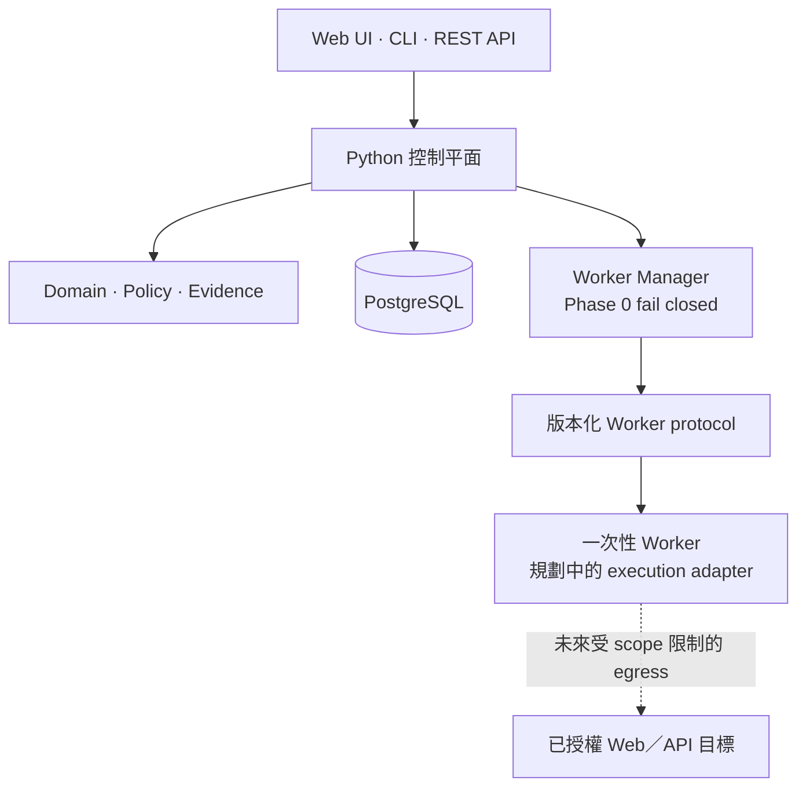

<div align="center">

# vuln-proof-claw

**以安全邊界為優先、以證據為核心的授權 Web／API 資安測試控制平面。**

[English](README.md) · [架構](ARCHITECTURE.zh-TW.md) · [路線圖](ROADMAP.zh-TW.md) · [安全政策](SECURITY.zh-TW.md) · [貢獻指南](CONTRIBUTING.zh-TW.md)

[](https://github.com/and910805/vuln-proof-claw/actions/workflows/ci.yml)
[](https://github.com/and910805/vuln-proof-claw/actions/workflows/container.yml)

[](CHANGELOG.zh-TW.md)
[](LICENSE)


</div>

> [!IMPORTANT]
> **Pre-alpha 狀態：** Phase 0 目前只提供控制平面的基礎建設，不會呼叫 LLM、
> 啟動掃描工具或對目標執行資安測試。在具備範圍限制的執行層完成並通過驗證前，
> Worker Manager 會維持 fail-closed。

## 為什麼需要 vuln-proof-claw？

可信的資安成果不只是一個「看起來可能成立」的漏洞推論。它還需要清楚的授權
邊界、可重現的證據、高風險操作的批准軌跡，以及獨立驗證結論的方法。

vuln-proof-claw 以這些要求作為核心設計：

- **先確認範圍，再執行動作**——正規化目標後，依主機、網段、連接埠、路徑、
  通訊協定與有效時間進行明確檢查。
- **先取得證據，再提出結論**——透過 canonical metadata 與 SHA-256 hash chain，
  讓證據紀錄可以驗證。
- **依風險要求批准**——動作分為 L0 至 L4，批准會綁定到確切動作與受保護參數。
- **從架構落實隔離**——面向目標的工作規劃由一次性、無 Provider 憑證且資源與
  網路受限的 Worker 執行。
- **預設安全失敗**——未知動作採保守風險等級、無效範圍直接拒絕，未完成的執行
  路徑維持停用。

## 目前具備的能力

| 領域 | Phase 0 已完成 |
| --- | --- |
| CLI | 版本指令與不洩漏憑證的 `doctor` 環境診斷 |
| REST API | 版本化 liveness、readiness contract 與 OpenAPI |
| Web 控制台 | 內建 React／TypeScript 儀表板、雙語介面、建立專案與如實能力狀態 |
| Evidence Core 預覽版 | 持久化評估範圍、離線目標政策判斷，以及僅含 metadata 的 JSON／Markdown 報告 |
| Domain | Project、Engagement、Task、Flow、Action、Approval、Evidence 與 Finding |
| Policy | Web／API 目標正規化、default-deny scope、L0–L4 風險與動作綁定批准 |
| Evidence | Canonical serialization、SHA-256 digest 與防竄改 hash-chain primitives |
| Persistence | PostgreSQL repository 與 Alembic migration，Domain 不依賴 ORM |
| Observability | 結構化 human／JSON 日誌與遞迴式機密遮蔽 |
| Worker | 版本化 request／response protocol、資源限制及 fail-closed Manager interface |
| Delivery | 強化的 Docker Compose 基線、雙語檢查、依賴稽核、容器掃描與 SBOM CI |

目標探索、資安工具執行、LLM orchestration、Planner／Operator／Verifier agents 與
報告產生都屬於後續路線圖，並不是目前 Phase 0 已提供的功能。

## 快速開始

### 方案 A：Docker Compose

這是推薦的本機啟動方式，會啟動 API 與 PostgreSQL。

需求：Git 與 Docker Compose v2。

```bash
git clone https://github.com/and910805/vuln-proof-claw.git
cd vuln-proof-claw
docker compose up --build -d
```

檢查服務：

```bash
curl --fail http://127.0.0.1:8080/api/v1/health/ready
```

接著可以開啟：

- Web 控制台：<http://127.0.0.1:8080/>
- API 文件：<http://127.0.0.1:8080/docs>
- Liveness：<http://127.0.0.1:8080/api/v1/health/live>
- Readiness：<http://127.0.0.1:8080/api/v1/health/ready>

停止服務但保留資料庫資料：

```bash
docker compose down
```

Compose 的預設帳密只適用於本機開發。在共用環境使用前，請自行設定 PostgreSQL
憑證。

### 方案 B：本機 CLI

需求：Python 3.12 以上。安裝時不強制要求 PostgreSQL、API 與 Docker，但
`doctor` 會如實回報缺少的服務。

PowerShell：

```powershell
git clone https://github.com/and910805/vuln-proof-claw.git
Set-Location vuln-proof-claw
python -m venv .venv
.\.venv\Scripts\python.exe -m pip install --upgrade "pip>=26.1.2"
.\.venv\Scripts\python.exe -m pip install --editable ".[dev]"
.\.venv\Scripts\python.exe -m vuln_proof_claw --version
.\.venv\Scripts\python.exe -m vuln_proof_claw doctor
```

Linux 與 macOS：

```bash
git clone https://github.com/and910805/vuln-proof-claw.git
cd vuln-proof-claw
python3 -m venv .venv
.venv/bin/python -m pip install --upgrade "pip>=26.1.2"
.venv/bin/python -m pip install --editable ".[dev]"
.venv/bin/python -m vuln_proof_claw --version
.venv/bin/python -m vuln_proof_claw doctor
```

使用 `doctor --json` 可以取得穩定、適合程式處理的 v1 診斷結果。

## 風險與批准模型

Policy core 會在執行前為動作分類：

| 等級 | 範例 | 預設政策 |
| --- | --- | --- |
| L0 | 公開頁面、`robots.txt`、被動指紋辨識 | 自動 |
| L1 | 目錄枚舉、連接埠掃描、主動 API 探測 | 可由 Project 設定 |
| L2 | Exploit 嘗試、密碼測試、檔案上傳 | 必須明確批准 |
| L3 | 後滲透、權限提升、橫向移動 | 必須明確批准 |
| L4 | 資料修改／刪除、持久化、破壞性操作 | 預設停用；需啟用 Project 並逐次批准 |

批准不能授權已被修改的 payload、目標或受保護參數。超出 scope 與永久禁止規則
的優先權高於批准。

## 架構



控制平面採用 Python modular monolith。Domain code 不依賴 FastAPI、SQLAlchemy、
Docker 或 Provider SDK。面向目標的執行會跨越明確的 Worker protocol boundary，
且設計上不會取得 Provider 憑證或掛載主機的家目錄。

更完整的 trust boundary 與 invariant，請參閱
[ARCHITECTURE.zh-TW.md](ARCHITECTURE.zh-TW.md) 與
[Worker 與容器安全](docs/WORKER_SECURITY.zh-TW.md)。

## 設定

設定使用以 `VULN_PROOF_CLAW_` 開頭的巢狀環境變數：

| 變數 | 用途 | 預設值 |
| --- | --- | --- |
| `VULN_PROOF_CLAW_APP__ENVIRONMENT` | `development`、`test` 或 `production` | `development` |
| `VULN_PROOF_CLAW_API__HOST` | API 綁定位址 | `127.0.0.1` |
| `VULN_PROOF_CLAW_API__PORT` | API 連接埠 | `8080` |
| `VULN_PROOF_CLAW_DATABASE__URL` | SQLAlchemy PostgreSQL URL | 本機 PostgreSQL URL |
| `VULN_PROOF_CLAW_LOGGING__FORMAT` | `human` 或 `json` | `human` |
| `VULN_PROOF_CLAW_LOGGING__LEVEL` | 日誌等級 | `INFO` |

完整參考請見 [.env.example](.env.example)。請勿提交真實 Provider key、客戶憑證
或擷取到的目標資料。

## 專案狀態與路線圖

Phase 0 基礎建設已完成。下一個里程碑 v0.1 將聚焦 Evidence Core：持久化
Engagement、結構化 HTTP capture、一次性 Worker lifecycle，以及 Markdown／JSON
報告。

完整規劃請見 [ROADMAP.zh-TW.md](ROADMAP.zh-TW.md)。路線圖代表開發方向，不是
保證的發布日期。

## 文件

持續維護的專案文件會同時提供英文與繁體中文。若英文 Markdown 缺少對應的
`.zh-TW.md`，CI 會直接失敗。

| 主題 | English | 繁體中文 |
| --- | --- | --- |
| 架構 | [ARCHITECTURE.md](ARCHITECTURE.md) | [ARCHITECTURE.zh-TW.md](ARCHITECTURE.zh-TW.md) |
| 路線圖 | [ROADMAP.md](ROADMAP.md) | [ROADMAP.zh-TW.md](ROADMAP.zh-TW.md) |
| 安全政策 | [SECURITY.md](SECURITY.md) | [SECURITY.zh-TW.md](SECURITY.zh-TW.md) |
| 貢獻指南 | [CONTRIBUTING.md](CONTRIBUTING.md) | [CONTRIBUTING.zh-TW.md](CONTRIBUTING.zh-TW.md) |
| Web 控制台 | [docs/WEB_UI.md](docs/WEB_UI.md) | [docs/WEB_UI.zh-TW.md](docs/WEB_UI.zh-TW.md) |
| Evidence Core 預覽版 | [docs/EVIDENCE_CORE.md](docs/EVIDENCE_CORE.md) | [docs/EVIDENCE_CORE.zh-TW.md](docs/EVIDENCE_CORE.zh-TW.md) |
| 平台設計 | [English](docs/superpowers/specs/2026-07-30-vuln-proof-claw-platform-design.md) | [繁體中文](docs/superpowers/specs/2026-07-30-vuln-proof-claw-platform-design.zh-TW.md) |
| Phase 0 實作計畫 | [English](docs/superpowers/plans/2026-07-30-phase-0-foundation-implementation-plan.md) | [繁體中文](docs/superpowers/plans/2026-07-30-phase-0-foundation-implementation-plan.zh-TW.md) |

## 開發

安裝 development dependencies 後執行：

```bash
python -m ruff check .
python -m mypy
python -m pytest --cov=vuln_proof_claw --cov-report=term-missing
python scripts/check_bilingual_docs.py
python -m pip_audit
python -m bandit -r src
```

即時 PostgreSQL 與 Docker Compose integration test 採 opt-in。預設 unit test
不會連線至外部目標。

## 合法與負責任的使用

只可將 vuln-proof-claw 用於你擁有或已獲明確授權測試的系統。測試前必須定義
Engagement scope、盡可能減少資料存取，並在繼續操作可能傷害使用者或基礎設施時
停止測試。

若發現本專案本身的安全漏洞，請依照 [SECURITY.zh-TW.md](SECURITY.zh-TW.md)
私下通報，不要建立公開 Issue。

## 參與貢獻

歡迎 Bug report、設計討論、文件改善與範圍明確的 Pull Request。開始前請閱讀
[CONTRIBUTING.zh-TW.md](CONTRIBUTING.zh-TW.md) 與
[行為準則](CODE_OF_CONDUCT.zh-TW.md)。

## 授權

vuln-proof-claw 採用 [MIT License](LICENSE)。
