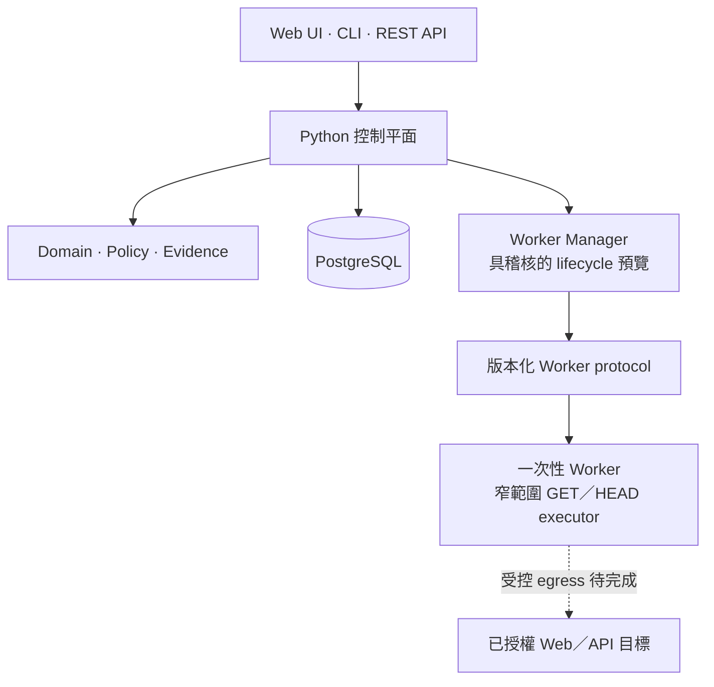

<div align="center">

# vuln-proof-claw

**以安全邊界為優先、以證據為核心的授權 Web／API 資安測試控制平面。**

[English](README.md) · [架構](ARCHITECTURE.zh-TW.md) · [路線圖](ROADMAP.zh-TW.md) · [安全政策](SECURITY.zh-TW.md) · [貢獻指南](CONTRIBUTING.zh-TW.md)

[](https://github.com/and910805/vuln-proof-claw/actions/workflows/ci.yml)
[](https://github.com/and910805/vuln-proof-claw/actions/workflows/container.yml)

[](CHANGELOG.zh-TW.md)
[](LICENSE)


</div>

> **v0.6.0 重大更新：** 新增一鍵 Metadata-only Disclosure Bundle 與離線 SHA-256
> 驗證；Raw Evidence 與 Secret 仍明確排除。v0.5.0 建立的有界
> Planner／Operator／Verifier 與本機 MCP 基礎維持不變。

> [!IMPORTANT]
> **Alpha 狀態：** 0.6.0 已提供可驗證成果交付；Browser、Preset 與
> Planner／Operator／Verifier 仍以 API／MCP 為主，不會送出破壞性 Payload 或任意執行掃描器。
>
> 0.3.0 在有界 Web Discovery 上加入已授權的安全主動測試。系統會
> 解析已擷取的 OpenAPI 文件，且只透過既有 Scope、DNS、Evidence 與 Budget 控制驗證
> 無必要參數的 GET／HEAD Operation；仍不會登入、提交 Form、啟動外部掃描器或送出 Exploit Payload。

## 為什麼需要 vuln-proof-claw？

可信的資安成果不只是一個「看起來可能成立」的漏洞推論。它還需要清楚的授權
邊界、可重現的證據、高風險操作的批准軌跡，以及獨立驗證結論的方法。

vuln-proof-claw 以這些要求作為核心設計：

- **先確認範圍，再執行動作**——正規化目標後，依主機、網段、連接埠、路徑、
  通訊協定與有效時間進行明確檢查。
- **先取得證據，再提出結論**——透過 canonical metadata 與 SHA-256 hash chain，
  讓證據紀錄可以驗證。
- **依風險要求批准**——動作分為 L0 至 L4，批准會綁定到確切動作與受保護參數。
- **從架構落實隔離**——面向目標的工作規劃由一次性、無 Provider 憑證且資源與
  網路受限的 Worker 執行。
- **預設安全失敗**——未知動作採保守風險等級、無效範圍直接拒絕，未完成的執行
  路徑維持停用。

## 目前具備的能力

| 領域 | 目前版本 |
| --- | --- |
| CLI | 版本、不洩漏憑證的 `doctor`，以及不需網路的 `verify-bundle` |
| REST API | 版本化 health、project、engagement、自動評估、workflow、audit、report contract 與 OpenAPI |
| Web 控制台 | 雙語 URL-first 安全自動測試、Discovery fallback、Safe／Fast／Deep、Finding、歷史、四種報告與可驗證 Disclosure Bundle |
| Evidence Core | 多頁 Discovery、OpenAPI 語意 Inventory、有界唯讀 API 驗證、Transactional Evidence 與不可變報告 |
| Domain | Project、Engagement、Task、Flow、Action、Approval、Evidence 與 Finding |
| Policy | Web／API 目標正規化、default-deny scope、L0–L4 風險與動作綁定批准 |
| Authentication | 可選的 API-wide Bearer boundary，以及分離的 operator、approver 與 evidence-reader role |
| Evidence | Canonical serialization、SHA-256 digest 與防竄改 hash-chain primitives |
| Persistence | PostgreSQL repository 與 Alembic migration，Domain 不依賴 ORM |
| Observability | 結構化 human／JSON 日誌與遞迴式機密遮蔽 |
| Execution | DNS-pinned GET／HEAD 驗證、一次性 Playwright Chromium Context、記憶體內登入憑證、跨主機阻擋、持久化 Worker 與受限 Container Policy；任意工具仍停用 |
| Automation | 經審查的 Query／Header／Path 變異、CORS／Authentication／Authorization／輸入驗證比較、Approval Preset 與 Planner／Operator／Verifier 任務產生 |
| AI 介面 | Codex、Claude Code 與相容 Client 可使用的本機 stdio MCP Server；Provider 憑證不會交給 ProofClaw |
| Delivery | 強化的 Docker Compose 基線、雙語檢查、依賴稽核、容器掃描與 SBOM CI |

v0.5.0 的 Browser 與 Automation 目前以 API／MCP 為主；Web Console 操作介面、更多 Session
登入方式、即時進度、外部資安工具、Exploit Execution 與 Bug-bounty 專用報告仍屬後續路線圖。
請參閱[安全自動化核心](docs/SAFE_AUTOMATION.zh-TW.md)與 [AI 驅動架構](docs/AI_DRIVER.zh-TW.md)。

## 版本重大更新

專案刻意拆成可審查的小里程碑。每一版都新增一條使用者可以完成的流程，並清楚
保留執行邊界。

| 版本 | 重大新增 | 目前仍不會做的事 |
| --- | --- | --- |
| **v0.1.0** | 第一條可使用的被動評估流程：URL-first Web Console、自動建立 Project／Engagement、精確 Scope、DNS-pinned GET Capture、Header／Cookie Finding、Evidence 完整性、JSON／Markdown 報告與持久化歷史。 | 不會 Crawl、登入、提交 Form、送出 Active Payload 或自動確認漏洞。 |
| **v0.2.0** | 有界同源 Discovery、Safe／Fast／Deep Budget、逐頁 Evidence、聚合 Finding、Severity／Confidence／Remediation 與安全轉義 HTML 報告。 | 不會 Authentication、Browser Session、外部 Scanner、參數變異或 Exploit 驗證。 |
| **v0.3.0** | OpenAPI 3.x／Swagger 2.0 Operation Inventory，以及 `active-safe` 無必要參數 GET／HEAD 驗證；包含具 Evidence 的宣告式 Authentication 異常 Candidate。 | 不會送出寫入 Method、必要參數、登入、Browser Automation、Exploit Payload 或任意工具。 |
| **v0.3.1** | 文件與 Release Metadata 更新：版本歷史、修正 Quick Start 說明，以及同步 Package／User-Agent 版本。 | 沒有新增目標流量能力；安全邊界與 v0.3.0 相同。 |
| **v0.4.0** | Operator Finding 審查、樂觀版本檢查與不可變 Audit Event；SARIF 2.1.0 直接報告與具 Idempotency 的不可變匯出；Web console SARIF 下載。 | 尚未提供 Planner／Operator／Verifier 編排、Browser Authentication、寫入 Method 測試、Exploit Payload 或任意工具。 |
| **v0.5.0** | 一次性 Authenticated Chromium Context、經審查的無害參數變異、四類安全比較、可重用 Approval Preset、Planner／Operator／Verifier 計畫與 Codex／Claude Code stdio MCP 工具。 | 進階路徑仍以 API／MCP 為主；不提供破壞性 Payload、任意 Scanner、自動權限提升或無限制目標存取。 |
| **v0.6.0** | Metadata-only Disclosure ZIP，包含 JSON／Markdown／HTML／SARIF、Workflow 與 Evidence Chain Metadata、Web 下載及具 ZIP 結構與篡改防護的離線驗證器。 | 不公開 Raw Evidence、不宣稱簽署者身分、不執行任意 Scanner、Exploit Payload 或無限制目標存取。 |

實作細節與下一階段請參閱 [ROADMAP.zh-TW.md](ROADMAP.zh-TW.md) 及
[CHANGELOG.zh-TW.md](CHANGELOG.zh-TW.md) 的版本記錄。

## 快速開始

### 方案 A：Docker Compose

這是推薦的本機啟動方式，會啟動 API 與 PostgreSQL。

需求：Git 與 Docker Compose v2。

```bash
git clone https://github.com/and910805/vuln-proof-claw.git
cd vuln-proof-claw
docker compose up --build -d
```

開啟 <http://127.0.0.1:8080/>，選擇「評估網址」，輸入你確實獲得授權的公開
HTTP(S) 網址、完成一次授權聲明並開始。第一次執行會自動建立私有工作區；安全自動
模式會探索同源頁面並驗證符合條件的唯讀 API，也可在表單切換成僅 Discovery、Fast
或 Deep。結果頁會顯示 Finding、API Inventory、Active Probe 數量、Evidence 完整性，
並提供 JSON、Markdown、安全轉義 HTML 與 SARIF 2.1.0 報告。
結果與歷史頁面也能下載可自行驗證的 Disclosure Bundle。

檢查服務：

```bash
curl --fail http://127.0.0.1:8080/api/v1/health/ready
```

接著可以開啟：

- Web 控制台：<http://127.0.0.1:8080/>
- API 文件：<http://127.0.0.1:8080/docs>
- Liveness：<http://127.0.0.1:8080/api/v1/health/live>
- Readiness：<http://127.0.0.1:8080/api/v1/health/ready>

停止服務但保留資料庫資料：

```bash
docker compose down
```

Compose 的預設值只適用本機開發，只啟用有界的安全評估，且 UI 綁定 loopback。
在共用環境使用前，請自行設定 PostgreSQL 憑證並啟用 API authentication；本機
profile 以外的應用程式預設仍維持 fail closed。

### 方案 B：本機 CLI

需求：Python 3.12 以上。安裝時不強制要求 PostgreSQL、API 與 Docker，但
`doctor` 會如實回報缺少的服務。

PowerShell：

```powershell
git clone https://github.com/and910805/vuln-proof-claw.git
Set-Location vuln-proof-claw
python -m venv .venv
.\.venv\Scripts\python.exe -m pip install --upgrade "pip>=26.1.2"
.\.venv\Scripts\python.exe -m pip install --editable ".[dev]"
.\.venv\Scripts\python.exe -m vuln_proof_claw --version
.\.venv\Scripts\python.exe -m vuln_proof_claw doctor
```

Linux 與 macOS：

```bash
git clone https://github.com/and910805/vuln-proof-claw.git
cd vuln-proof-claw
python3 -m venv .venv
.venv/bin/python -m pip install --upgrade "pip>=26.1.2"
.venv/bin/python -m pip install --editable ".[dev]"
.venv/bin/python -m vuln_proof_claw --version
.venv/bin/python -m vuln_proof_claw doctor
```

使用 `doctor --json` 可以取得穩定、適合程式處理的 v1 診斷結果。

不連線 API 或目標即可驗證下載的 Disclosure Bundle：

```bash
vuln-proof-claw verify-bundle engagement-disclosure.zip
```

## 風險與批准模型

Policy core 會在執行前為動作分類：

| 等級 | 範例 | 預設政策 |
| --- | --- | --- |
| L0 | 公開頁面、`robots.txt`、被動指紋辨識 | 自動 |
| L1 | 目錄枚舉、連接埠掃描、主動 API 探測 | 可由 Project 設定 |
| L2 | Exploit 嘗試、密碼測試、檔案上傳 | 必須明確批准 |
| L3 | 後滲透、權限提升、橫向移動 | 必須明確批准 |
| L4 | 資料修改／刪除、持久化、破壞性操作 | 預設停用；需啟用 Project 並逐次批准 |

批准不能授權已被修改的 payload、目標或受保護參數。超出 scope 與永久禁止規則
的優先權高於批准。

## 架構



控制平面採用 Python modular monolith。Domain code 不依賴 FastAPI、SQLAlchemy、
Docker 或 Provider SDK。面向目標的執行會跨越明確的 Worker protocol boundary，
且設計上不會取得 Provider 憑證或掛載主機的家目錄。

更完整的 trust boundary 與 invariant，請參閱
[ARCHITECTURE.zh-TW.md](ARCHITECTURE.zh-TW.md) 與
[Worker 與容器安全](docs/WORKER_SECURITY.zh-TW.md)。

## 設定

設定使用以 `VULN_PROOF_CLAW_` 開頭的巢狀環境變數：

| 變數 | 用途 | 預設值 |
| --- | --- | --- |
| `VULN_PROOF_CLAW_APP__ENVIRONMENT` | `development`、`test` 或 `production` | `development` |
| `VULN_PROOF_CLAW_API__HOST` | API 綁定位址 | `127.0.0.1` |
| `VULN_PROOF_CLAW_API__PORT` | API 連接埠 | `8080` |
| `VULN_PROOF_CLAW_DATABASE__URL` | SQLAlchemy PostgreSQL URL | 本機 PostgreSQL URL |
| `VULN_PROOF_CLAW_LOGGING__FORMAT` | `human` 或 `json` | `human` |
| `VULN_PROOF_CLAW_LOGGING__LEVEL` | 日誌等級 | `INFO` |

完整參考請見 [.env.example](.env.example)。請勿提交真實 Provider key、客戶憑證
或擷取到的目標資料。

## 專案狀態與路線圖

Phase 0 與有界 Discovery 已完成。0.4.0 新增具 Evidence 的 Finding Operator 審查與 SARIF 2.1.0
匯出。0.3.0 新增 OpenAPI Operation 語意 Inventory，以及
無必要參數唯讀 Operation 的自動驗證；若規格宣告 Authentication 但匿名請求取得 2xx，
會產生具 Evidence 的候選 Finding。Authenticated Browser 與改變狀態的測試仍屬後續里程碑。

完整規劃請見 [ROADMAP.zh-TW.md](ROADMAP.zh-TW.md)。路線圖代表開發方向，不是
保證的發布日期。

## 文件

持續維護的專案文件會同時提供英文與繁體中文。若英文 Markdown 缺少對應的
`.zh-TW.md`，CI 會直接失敗。

| 主題 | English | 繁體中文 |
| --- | --- | --- |
| 架構 | [ARCHITECTURE.md](ARCHITECTURE.md) | [ARCHITECTURE.zh-TW.md](ARCHITECTURE.zh-TW.md) |
| 路線圖 | [ROADMAP.md](ROADMAP.md) | [ROADMAP.zh-TW.md](ROADMAP.zh-TW.md) |
| 安全政策 | [SECURITY.md](SECURITY.md) | [SECURITY.zh-TW.md](SECURITY.zh-TW.md) |
| 貢獻指南 | [CONTRIBUTING.md](CONTRIBUTING.md) | [CONTRIBUTING.zh-TW.md](CONTRIBUTING.zh-TW.md) |
| Web 控制台 | [docs/WEB_UI.md](docs/WEB_UI.md) | [docs/WEB_UI.zh-TW.md](docs/WEB_UI.zh-TW.md) |
| Evidence Core 預覽版 | [docs/EVIDENCE_CORE.md](docs/EVIDENCE_CORE.md) | [docs/EVIDENCE_CORE.zh-TW.md](docs/EVIDENCE_CORE.zh-TW.md) |
| 受控 HTTP Capture | [docs/HTTP_CAPTURE.md](docs/HTTP_CAPTURE.md) | [docs/HTTP_CAPTURE.zh-TW.md](docs/HTTP_CAPTURE.zh-TW.md) |
| 控制平面工作流程 API | [docs/WORKFLOW_API.md](docs/WORKFLOW_API.md) | [docs/WORKFLOW_API.zh-TW.md](docs/WORKFLOW_API.zh-TW.md) |
| Authentication 與 Approval | [docs/AUTH_AND_APPROVALS.md](docs/AUTH_AND_APPROVALS.md) | [docs/AUTH_AND_APPROVALS.zh-TW.md](docs/AUTH_AND_APPROVALS.zh-TW.md) |
| Evidence 存取與報告匯出 | [docs/EVIDENCE_ACCESS_AND_REPORT_EXPORTS.md](docs/EVIDENCE_ACCESS_AND_REPORT_EXPORTS.md) | [docs/EVIDENCE_ACCESS_AND_REPORT_EXPORTS.zh-TW.md](docs/EVIDENCE_ACCESS_AND_REPORT_EXPORTS.zh-TW.md) |
| 可驗證 Disclosure Bundle | [docs/DISCLOSURE_BUNDLES.md](docs/DISCLOSURE_BUNDLES.md) | [docs/DISCLOSURE_BUNDLES.zh-TW.md](docs/DISCLOSURE_BUNDLES.zh-TW.md) |
| Passive URL assessment | [docs/PASSIVE_ASSESSMENT.md](docs/PASSIVE_ASSESSMENT.md) | [docs/PASSIVE_ASSESSMENT.zh-TW.md](docs/PASSIVE_ASSESSMENT.zh-TW.md) |
| AI 驅動架構 | [docs/AI_DRIVER.md](docs/AI_DRIVER.md) | [docs/AI_DRIVER.zh-TW.md](docs/AI_DRIVER.zh-TW.md) |
| 拋棄式 Worker lifecycle | [docs/WORKER_LIFECYCLE.md](docs/WORKER_LIFECYCLE.md) | [docs/WORKER_LIFECYCLE.zh-TW.md](docs/WORKER_LIFECYCLE.zh-TW.md) |
| Runtime 資源清理器 | [docs/RUNTIME_JANITOR.md](docs/RUNTIME_JANITOR.md) | [docs/RUNTIME_JANITOR.zh-TW.md](docs/RUNTIME_JANITOR.zh-TW.md) |
| 受限 Docker runtime 邊界 | [docs/RESTRICTED_RUNTIME.md](docs/RESTRICTED_RUNTIME.md) | [docs/RESTRICTED_RUNTIME.zh-TW.md](docs/RESTRICTED_RUNTIME.zh-TW.md) |
| Authenticated Engine gateway boundary | [docs/ENGINE_GATEWAY.md](docs/ENGINE_GATEWAY.md) | [docs/ENGINE_GATEWAY.zh-TW.md](docs/ENGINE_GATEWAY.zh-TW.md) |
| Restricted Docker Engine backend | [docs/DOCKER_ENGINE_BACKEND.md](docs/DOCKER_ENGINE_BACKEND.md) | [docs/DOCKER_ENGINE_BACKEND.zh-TW.md](docs/DOCKER_ENGINE_BACKEND.zh-TW.md) |
| Worker HTTP executor | [docs/WORKER_HTTP_EXECUTOR.md](docs/WORKER_HTTP_EXECUTOR.md) | [docs/WORKER_HTTP_EXECUTOR.zh-TW.md](docs/WORKER_HTTP_EXECUTOR.zh-TW.md) |
| 平台設計 | [English](docs/superpowers/specs/2026-07-30-vuln-proof-claw-platform-design.md) | [繁體中文](docs/superpowers/specs/2026-07-30-vuln-proof-claw-platform-design.zh-TW.md) |
| Phase 0 實作計畫 | [English](docs/superpowers/plans/2026-07-30-phase-0-foundation-implementation-plan.md) | [繁體中文](docs/superpowers/plans/2026-07-30-phase-0-foundation-implementation-plan.zh-TW.md) |

## 開發

安裝 development dependencies 後執行：

```bash
python -m ruff check .
python -m mypy
python -m pytest --cov=vuln_proof_claw --cov-report=term-missing
python scripts/check_bilingual_docs.py
python -m pip_audit
python -m bandit -r src
```

即時 PostgreSQL 與 Docker Compose integration test 採 opt-in。預設 unit test
不會連線至外部目標。

## 合法與負責任的使用

只可將 vuln-proof-claw 用於你擁有或已獲明確授權測試的系統。測試前必須定義
Engagement scope、盡可能減少資料存取，並在繼續操作可能傷害使用者或基礎設施時
停止測試。

若發現本專案本身的安全漏洞，請依照 [SECURITY.zh-TW.md](SECURITY.zh-TW.md)
私下通報，不要建立公開 Issue。

## 參與貢獻

歡迎 Bug report、設計討論、文件改善與範圍明確的 Pull Request。開始前請閱讀
[CONTRIBUTING.zh-TW.md](CONTRIBUTING.zh-TW.md) 與
[行為準則](CODE_OF_CONDUCT.zh-TW.md)。

## 授權

vuln-proof-claw 採用 [MIT License](LICENSE)。
